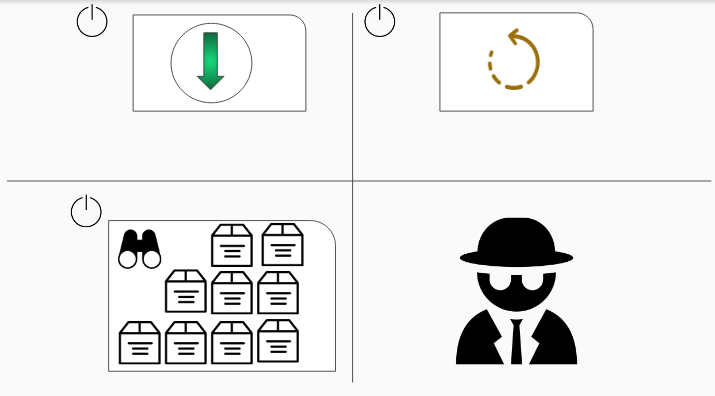
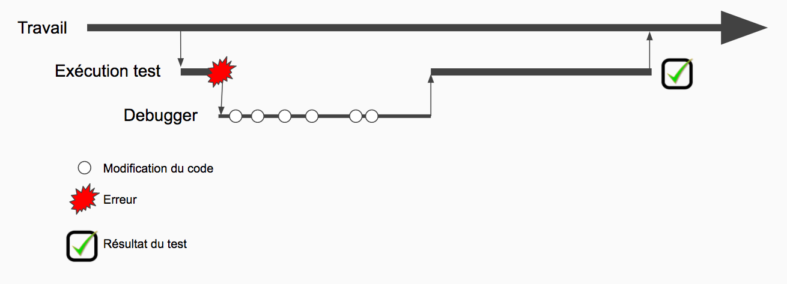
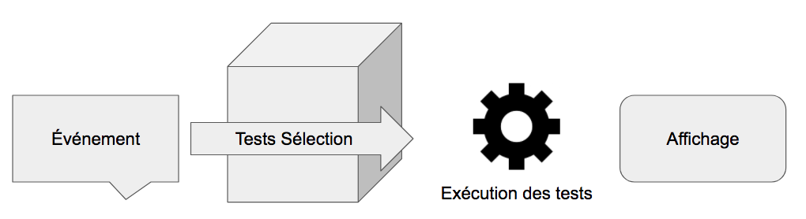
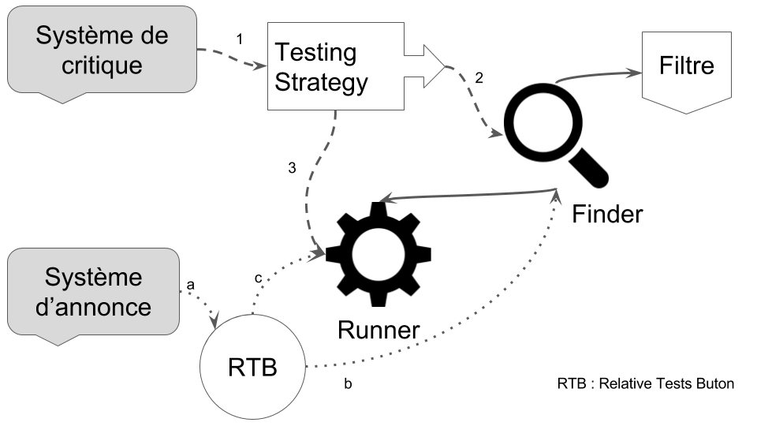
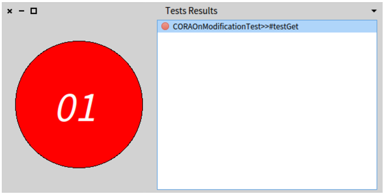
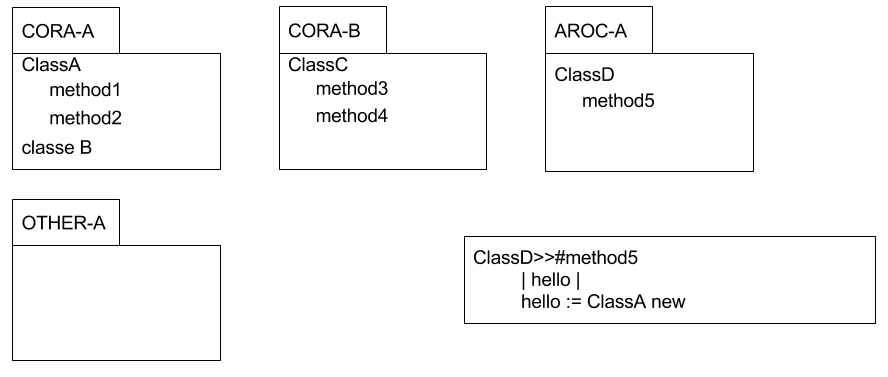
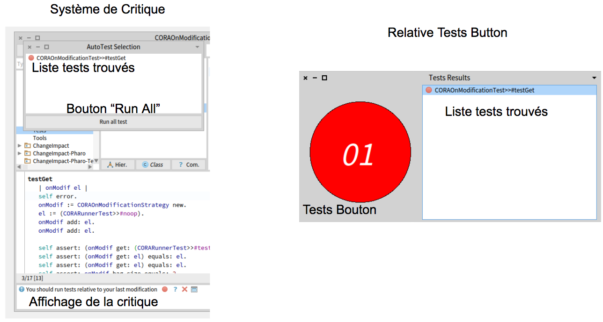

# Réalisations

Durant mon stage, j'ai créé deux logiciels.
Le premier, "Tests Usage Analyser", est un espion permettant de collecter des données sur le comportement vis-à-vis des tests d'un développeur.
Le second, SmartTest, est un outil simplifiant la sélection de tests à lancer après une modification du code source.

## Tests Usage Analyser

### Objectif
\label{objectif1}

Avant de créer un outil permettant d'aider les développeurs dans leurs développements,
  j'ai étudié leur comportement afin de fournir une solution plus appropriée à leurs besoins.
C'est pour cela que j'ai développé "Tests Usage Analyser"  (TUA).
Ce logiciel est un espion qui, une fois installé, va récolter les informations relatives
  aux comportements d'un développeur vis-à-vis des tests.
En particulier "Tests Usage Analyser" récolte pour chaque modification de code :

- Le type de modification
    - ajout/suppression/modification de méthode
    - ajout/suppression/modification de classe
    - ajout/suppression/modification d'un commentaire
- Le code de la modification (snapshot)
- L'identifiant unique du développeur
- Le timestamp du moment de la modification

TUA récolte aussi pour chaque test lancé :

- Le nom exact du test lancé
- Le résultat du test
    - PASS (test réussi)
    - FAIL (test échoué)
    - ERROR (test non arrivé à bout ; une exception levée par exemple)
- L'identifiant du groupe de tests lancés en même temps que celui-ci
- Le timestamp du moment où le test a été lancé
- L'identifiant unique du développeur

Récupérer l'ensemble de ces données m'aura permis d'analyser précisément l'utilisation des tests par les développeurs utilisant Pharo.

### Architecture

Le plugin est divisé en deux parties : le système qui gère l'installation et le démarrage de l'application (Start Up)
et le système qui récolte les données détaillées en Figure \ref{startup} (Recording).

#### Start Up

{#startup width=300 height=300}

Dès que le plugin est installé, il effectue des actions automatiquement au démarrage de l'image Pharo.
"Tests Usage Analyser" se met à jour afin de s'assurer que le format des données  récolté est toujours de la dernière version
  et afin de me permettre de corriger de manière transparente les éventuelles erreurs de code que j'aurais pu faire.
Le plugin se télécharge sur l'espace de travail de l'utilisateur s'il en utilise un nouveau ;
  récolte les informations relatives à l'espace de travail utilisé, et
  démarre la récolte des informations que nous avons détaillées Section \ref{objectif1}.

#### Recording

Une fois la récolte démarrée, TUA s'abonne au système d'annonce de Pharo.
Il va ainsi recevoir des informations sur les modifications du code source par le développeur.

Plus précisément, TUA reçoit pour chaque modification le nom de l'entité affectée par le changement (nom de la classe, de la méthode, ou du paquet),
  le type de modification (suppression, ajout, etc.),
  le nouveau code source.
TUA formate alors ces données comme nous l'avons vu pour qu'elles puissent être étudiées.

{#debugger_coding width=500 height=400}

Pour les tests, TUA reçoit pour chaque test exécuté le nom du test, le groupe de tests dont il fait partie, et son statut.
Cependant, en Pharo, il est aussi possible qu'un test ne se finisse pas.
En effet, un utilisateur peut décider d'interrompre un test pendant son exécution.
Il a donc fallu détecter les fins de tests prématurées.
De plus, lorsqu'un test provoque une erreur, un debugger s'ouvre permettant au développeur de corriger son code.
Dans ce cas, TUA enregistre deux tests exécutions, la première échouant et terminant au moment de l'ouverture du debugger, la seconde ayant comme résultat le résultat du test en fin d’exécution et terminant à ce moment.
Nous voyons dans l'exemple de la Figure \ref{debugger_coding} qu'un développeur lance un test.
Ce test provoque une erreur. Un debugger s'ouvre et l'utilisateur fait des modifications du code source.
TUA enregistre deux tests, le premier échoue au moment de l'erreur, le second commence après que le test soit repris et finira à la fin de l'exécution.

Tout ceci permet de recevoir les informations sur les actions faites par le développeur.
Le plugin utilise ces informations pour créer des nouvelles données formatées comme décrites ci-dessus.
Elles seront ensuite envoyées sur un serveur distant, pour être finalement récupérées et analysées.

### IWST

Grâce à cet outil,
j'ai rédigé une analyse dans un papier qui a été accepté à IWST^[[International Workshop on Smalltalk Technologies](http://www.esug.org/wiki/)].

Les principaux résultats que nous avons mis en évidence sont les suivants :

- Le nombre de tests qui réussissent est plus grand dans la communauté Pharo que dans les autres environnements (où une expérience similaire a été effectuée).
- Les développeurs de la communauté Pharo lancent plus souvent des tests.
- Contrairement à ce que nous pensions, les développeurs Pharo pratiquent leurs sélection de tests en fonction de la durée des tests. Si les tests ont une durée d'execution trop longue, les développeurs les sélectionneront moins souvent.

\newpage

## SmartTest

Le développement de SmartTest a été ma seconde tâche.
SmartTest est un plugin pour l’environnement de travail Pharo.

### Objectif

Son objectif est d'aider les développeurs dans leur sélection de tests.
Nous avons supposé que si un plugin comme SmartTest fournit aux développeurs les tests relatifs
  aux changements de code source qu'ils viennent de faire, ils seront plus enclins à tester leurs
  applications et leurs sessions de tests seront plus précises et plus fréquentes.

Le développement d'une telle application est accompagné de contraintes.
Produire une solution utilisable par tout le monde est contraignante.
L'application doit être simple à installer,
  à utiliser et ne pas provoquer de perte de temps ou de frustration chez les développeurs.
Mon plugin doit donc rapidement fournir des résultats précis.
Pour cela, le plugin a été créé pour être facilement maintenable mais aussi adaptable.
C'est ce que nous allons voir dans l'architecture de SmartTest.

### Architecture

{#general_overview width=400 height=300}

Comme le montre la Figure \ref{general_overview}, SmartTest est une succession de petits outils s'appelant les uns les autres.
Une "recherche de tests" commence toujours par un événement déclencheur de la recherche.
Puis SmartTest effectue la recherche et demande à son "runner" d’exécuter les tests trouvés.
Enfin SmartTest affiche le résultat à l'écran.

Chacune de ces parties peut être subdivisée en plusieurs parties.
Comme il est présenté dans la Figure \ref{architecture},
  l'événement déclencheur de SmartTest peut être le système de critiques de Pharo ou le système d'annonces de Pharo.

{#architecture width=300 height=300}

Le système de critiques appelle la Testing Strategy.
C'est elle qui définira le comportement vis-à-vis des tests trouvés.
La Testing Strategy interroge le Finder qui grâce au filtre et au runner de SmartTest va chercher les tests relatifs à une méthode.
Puis elle lancera ou non les tests trouvés en fonction de sa configuration.

Le système d'annonces n'utilise pas de la Testing Strategy.
En revanche, il est relié au "Relative Tests Button".
C'est ce dernier qui demandera au finder les tests relatifs à la modification d'une méthode et qui
  lancera les tests via le runner de SmartTest.

Toutes ces options sont détaillées dans les parties suivantes et peuvent être facilement étendues par l'utilisateur.

#### Déclencheurs de SmartTest

Les deux déclencheurs peuvent être le système de critiques nommé Quality Assistant (QA) et créé par Yuriy TYMCHUK ou le système d'annonces que j'ai utilisé en développant le "Relative Tests Button".

Le système de critiques permet d'afficher pour n'importe quelle entité du système des informations prédéfinies par un système de règles à propos de celle-ci.
Dans mon cas, j'utilise le système de critiques pour afficher les tests relatifs à une entité.
Quality Assistant demande à la stratégie de tests de s’exécuter à chaque fois que l'utilisateur clique sur une entité.
J'ai aussi ajouté des fonctionnalités à QA pour permettre à l'utilisateur d’exécuter les tests trouvés par le finder depuis son interface.
J'ai aussi dû ajouter des options pour permettre d'activer le système de critiques seulement quand l'utilisateur clique sur une méthode, ou seulement sur une classe, ou les deux.

{#relative_tests_button width=300 height=300}

La Figure \ref{relative_tests_button} présente l'interface du "Relative Tests Button" (RTB).
Ce composant s'abonne au système d'annonce de Pharo.
Lorsque un développeur modifie du code ou créer une nouvelle méthode, un évènement est envoyé.
Le RTB reçoit cet événement et interroge le finder pour enregistrer les tests relatifs à la modification.
En cliquant sur le bouton, tous les tests sont lancés via le runner de SmartTest.

#### Stratégie de tests

J'ai développé quatre stratégies de tests utilisés par le système de critiques.

- _Never_ est une stratégie qui ne lance pas les tests relatifs mais va seulement les afficher dans le système de critiques.
- _Five Minutes_ est une stratégie qui récolte tous les tests relatifs aux modifications que fait le développeur.
  Puis lance ces tests toutes les cinq minutes donnant ainsi un retour sur les derniers changements effectués.
- _Each Modification_ lance les tests relatifs à une modification dès que celle-ci est effectuée.
- _Always_ lance les tests relatifs à une méthode dès que celle-ci est sélectionnée par l'utilisateur dans l'environnement de travail de Pharo.

#### Finder

Le finder est l'outil principal de SmartTest puisque c'est lui qui va effectuer la recherche des tests relatifs à une méthode.
J'ai produit quatre finders différents.
Deux utilisent une méthodologie statique pour découvrir les tests relatifs, les deux autres utilisent une méthode dynamique.

La stratégie statique recherche les tests en analysant le code à un moment donné.
Être dans un environnement dynamiquement typé, comme en Pharo, empêche cette stratégie d'être très efficace.
Elle donne un nombre de tests supérieur au nombre de tests réels, mais les tests trouvés contiennent au moins tous les "bons tests" à exécuter.

La stratégie dynamique stocke en cache des exécutions de tests.
En recherchant dans le cache, elle retrouve les tests relatifs à une méthode en analysant les traces d'exécution.
Elle fournit ainsi l'ensemble des bons tests, sauf lorsque le cache devient obsolète.
Elle fournit alors un peu moins de résultats qu'elle ne le devrait.

SmartTest possède deux stratégies statiques qui se basent sur Change Impact (CI)^[[https://github.com/juliendelplanque/ChangeImpact](https://github.com/juliendelplanque/ChangeImpact)], un travail de Julien DELPLANQUE.
Et l'autre que j'ai programmé qui se base sur les _sender_ d'une méthode.

Change Impact est une solution qui a été développée pour trouver ce qu'implique la modification d'une méthode.
La suppression d'une méthode amène par exemple à la modification du corps d'une autre méthode.
Pour cela, CI analyse les appels des méthodes, les noms des attributs, les classes, etc.
Cet outil fournit de nombreuses informations à SmartTest.

Les _sender_ est une stratégie de recherche statique se basant uniquement sur les appels des méthodes.
Pour une méthode, elle cherche les autres méthodes l'appellant.
Pour ces nouvelles méthodes, elle cherche les méthodes les appellant, etc.
Finalement, elle trouve l'ensemble des tests relatifs à une méthode.
Cette stratégie peut très vite devenir explosive en sélectionnant toute l'image du développeur (puisque nous sommes dans un environnement dynamiquement typé).
C'est pour cela que j'ai introduit la notion de filtre détaillée Section \ref{filtre}.

Les deux stratégies dynamiques ont été créées grâce respectivement au Test Coverage de Pharo et à MetaLink.

Test Coverage permet de trouver pour un test les méthodes par lequel il est "passé".
Pour cela, la stratégie sélectionne toutes les méthodes par lesquelles un test pourrait passer.
Puis, elle installe un proxy dans chacune d'elles.
Ce proxy activera un flag si la méthode est exécutée.
La stratégie lance alors le test et enregistre les méthodes dont le flag est levé.
Ce sont les méthodes relatives au test qui vient d'être exécuté.
En procédant ainsi, et en sauvegardant les données collectées dans un cache, la stratégie est capable de fournir, après analyse, l'ensemble exact des méthodes relatives à un test.
Cependant, l'installation de proxy ne peut pas se faire dans toutes les méthodes du système.
Ainsi, le système de test, le système gérant l'AST^[Abstract Syntax Tree], ou le kernel de Pharo, ne peuvent pas être analysés par cette méthodologie.

[//]: # (Figure)

MetaLink permet lui aussi de trouver pour un test les méthodes par lequel il est "passé".
Cependant la stratégie n'a pas besoin d'effectuer une présélection des méthodes qui devraient être parcourues par le test.
Elle exécute le test et grâce à des MetaLink^[Un système de proxy pour Pharo],
  elle va être capable d'installer des proxy pendant l'exécution du test.
Au démarrage de l'exécution du test, un proxy analyse les différents noeuds de la méthode de test
  et ajoute pour chaque noeud correspondant à un envoi de message un autre proxy.
Ce dernier a donc connaissance de la méthode qui va être exécutée juste après lui et
  l'enregistre comme méthode relative au test que nous sommes en train d'exécuter.
Ce qui pâlit le problème du typage dynamique.

Tous les finders ont leurs avantages et inconvénients.
Cependant, c'est toujours la rapidité d’exécution qui pose problème.
Pour réduire l'impact de ce problème, j'ai ajouté un cache à tous les finders et la possibilité
  de préconfigurer une image depuis un serveur d'intégration continu.
La préconfiguration depuis le serveur d'intégration continue permet de remplir le cache.
Comme les recherches de tests peuvent être longue (plusieurs secondes), le cache
  évite que l'on recherche inutilement les tests déjà trouvés
De plus, il est possible de changer la zone de recherche.
Elle peut être configurée grâce aux filtres et à la stratégie de Change Impact.

#### Filtre

\label{filtre}

{#filter width=300 height=300}

L'objectif étant de fournir toujours le maximum de possibilités aux utilisateurs,
  j'ai créé trois filtres différents.

- _Null_ est un filtre ne filtrant rien. Ainsi toute l'image peut être parcourue librement.
- _Package_ est le filtre limitant les résultats de la recherche à ceux se trouvant à l'intérieur du paquet où la méthode a été sélectionnée.
- _Package Relatif_ est le filtre par défaut.
  Le filtre se base sur le nom du projet trouvé à partir du nom du paquet dans lequel la méthode se trouve.
  Le filtre inclut aussi les "projets" dans lesquels la classe de la méthode modifiée est appelée.
  Dans la Figure \ref{filter}, si l'on analyse la méthode `ClassA>>#Method1`{.st}, le nom du projet trouvé par le filtre est "CORA".
  Les tests dans les paquets "CORA-A" et "CORA-B" __ne__ seront __pas__ filtrés.
  De plus, dans le paquet "AROC-A" la méthode `ClassD>>#method5`{.st} appelle la classe de `ClassA>>#Method1`{.st}.
  Donc les tests dans le paquet "AROC-A" __ne__ seront __pas__ filtrés.

#### Runner

{#running_button_interface width=600 height=600}

Finalement, le runner est le dernier composant de SmartTest.
C'est lui qui est chargé de lancer les tests trouvés et qui permet d'adapter le comportement du plugin
  aux envies de l'utilisateur.
Il existe trois configurations possibles pour le runner.
Ces configurations réagiront différemment en fonction de la manière dont elles sont appelées.
Les différentes manières sont visibles Figure \ref{running_button_interface}.

- _Smart_
    - Avec le système de critiques, si le test est lancé depuis la liste des tests trouvés (bouton rouge sur la gauche des tests) et que le test échoue, alors le debugger s'ouvre.
    Si l'utilisateur clique sur le bouton "Run All" ou sur le bouton situé dans l'affichage des critiques, seuls les boutons des tests changent de couleurs.
    - Avec le "Relative Tests Button", en cliquant sur le "Tests Bouton", le debugger ne s'ouvre pas mais la couleur des boutons des tests changera.
    En cliquant sur les boutons de la liste des tests, le debugger s'ouvrira si le test échoue.
- _Debug_ affichera toujours le debugger si un test échoue. Si un ensemble de tests est lancé, l’exécution des tests s’arrête dès lors qu'un test échoue et le debugger s'ouvre.
- _Notice_ n'ouvrira jamais le debugger et mettra à jour l'environnement graphique de Pharo.

### Innovation Awards

Pendant mon stage, j'ai aussi eu l'occasion de participer à ESUG.
C'est dans ce cadre que j'ai travaillé sur la conception d'une vidéo présentant SmartTest.
Cette vidéo sera présentée pendant la conférence et je devrai présenter mon travail
  pendant deux heures.

### Blog Post

Afin de faciliter l'utilisation de SmartTest et de TUA,
  j'ai aussi rapidement conçu un site web accessible à l'adresse [http://badetitou.github.io](http://badetitou.github.io)
  dans lequel j'ai expliqué le fonctionnement de ces plugins.
L'objectif était aussi de convaincre plus de personnes d'utiliser les plugins afin de
  collecter des données pour les papiers futurs que l'équipe souhaite écrire.

### MetaLink

Enfin, j'ai été amené à travailler avec différents membres de l'équipe.
En particulier avec Marcus DENKER sur MetaLink.
MetaLink est un système permettant d'ajouter à la volée du code à exécuter n'importe où dans le code.
Je me suis aperçu qu'il y avait plusieurs bugs dans MetaLink qui empêchaient son utilisation avec SmartTest.
Nous avons donc corrigé ensemble ces failles permettant d'utiliser MetaLink dans l'ensemble du système sans provoquer d'erreur.

\newpage
